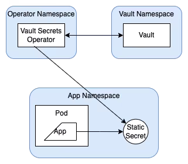
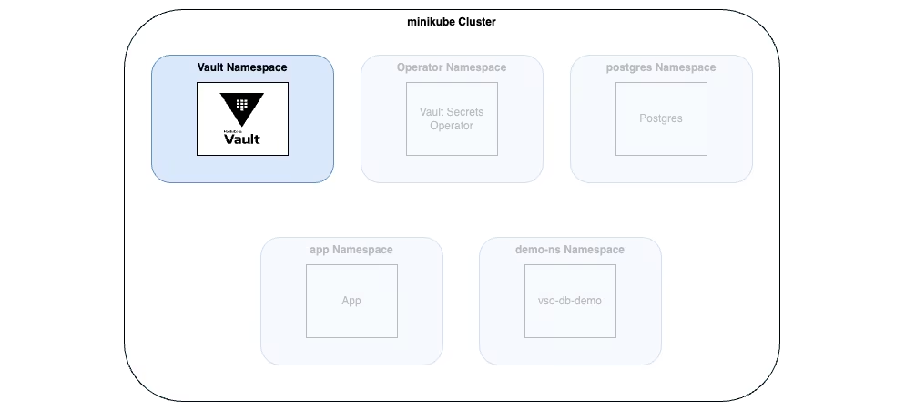
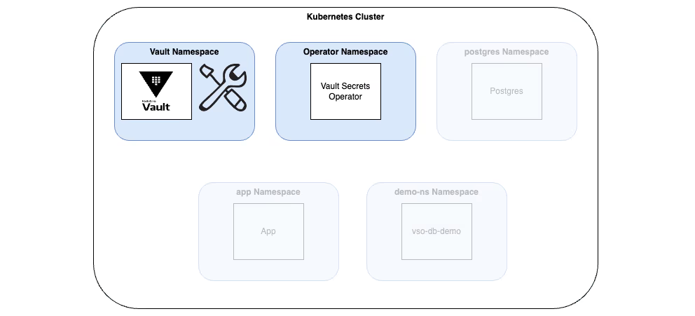
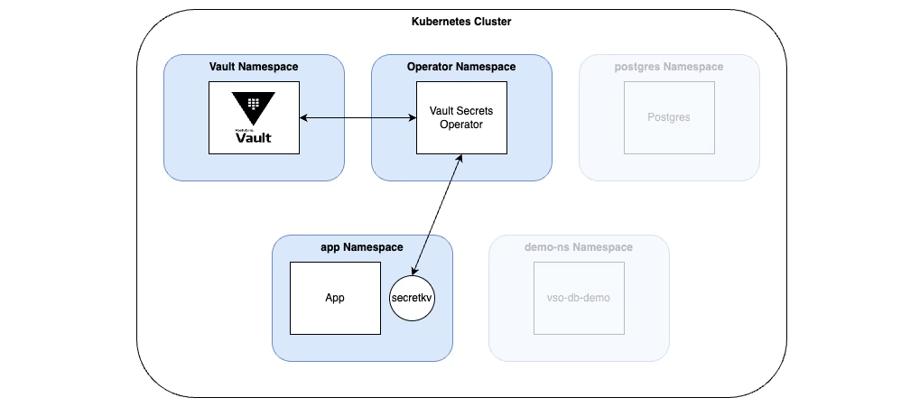
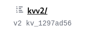
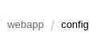

# What
 Vault Secrets Operator (VSO) updates Kubernetes native secrets. The user accesses Kubernetes native secrets managed on the backend by HashiCorp Vault.

 A Kubernetes operator is a software extension that uses custom resources to manage applications hosted on Kubernetes.

The Vault Secrets Operator is a Kubernetes operator that syncs secrets between Vault and Kubernetes natively without requiring the users to learn details of Vault use.

 

 The Vault Secrets Operator syncs the secrets between Vault and the Kubernetes secrets **in a specified namespace**. Within that namespace, applications have access to the secrets. The secrets are still managed by Vault, but accessed through the standard way on Kubernetes.

# Install Vault cluster


Start service if using minikube
```
minikube service vault-ui -n vault
```

If you want to enable access to vault interface, first get the logs:
```
$ k get logs -n vault 
...
Unseal Key: 5FFyVKcjcLTqaHuGJRp7i3Pv0XFEvuGrXZNV+U5G5YU=
Root Token: root
```

Then enable load balancer port:
```
$ minikube tunnel &
$ k get svc vault-ui
$ 

# Install Vault using Helm

```
helm repo add hashicorp https://helm.releases.hashicorp.com && helm repo update hashicorp
helm install vault hashicorp/vault --create-namespace -n vault --values vault/values-vault.yml
```

Wait till pod is up and running
```
$ k get pods
NAME      READY   STATUS    RESTARTS   AGE
vault-0   1/1     Running   0          4m9s
```

# Configure Vault
This step is only to have a secret running.  Enable and configure Kubernetes authentication, KV secrets engine, **a role and policy for Kubernetes, and create a static secret**

1. `$ k exec --stdin=true --tty=true vault-0 -n vault -- /bin/sh`
2. Enable Vault auth
```
$ cd /tmp
$ vault auth enable -path vso-auth-mount kubernetes
```
Pay attention to the env variable. This allows on the vso secret, the k8s to play around. In other words, which K8s can authenticate against Vault?
```
$ vault write auth/vso-auth-mount/config \
   kubernetes_host="https://$KUBERNETES_PORT_443_TCP_ADDR:443"

```
3. Enable kv v2 Secrets Engine
```
$ vault secrets enable -path=kvv2 kv-v2
```
4. Create a JSON file ith a policy. This policy allows the capability of read and list the folloing path `kvv2/data/webapp/config`
```
$ k cp vault/webapp.json vault-0:/tmp
```

And inside the pod:
```
$ vault policy write webapp /tmp/webapp.json
```

5. Create a role in vault to enable access to secrets within the kv v2 secrets engine. This role is the interface between k8s and vault. 
```
$ export VAULT_ADDR='http://[::]:8200'
$ export VAULT_SKIP_VERIFY=true
$ export VAULT_TOKEN=root
$ vault write -force auth/vso-auth-mount/role/webapp-role \
   bound_service_account_names=demo-static-app \
   bound_service_account_namespaces=app \
   policies=webapp \
   audience=vault \
   ttl=24h
```
* **bound_service_account_names**: The service account within K8s
* **bound_service_account_namespaces**: The namespace where the app runs
* **policies**: Which policies
* **ttl**: Time to live

6. Create a secret with to parameters, username and password. This, later will be retrieved from the app:
```
$ vault kv put kvv2/webapp/config \
username="static-user" \
password="static-password"
```

# Install vault operator

1. We will install it using Helm using the `vault/values-vso.yml` where
```
$ helm install vault-secrets-operator hashicorp/vault-secrets-operator -n vault-secrets-operator-system --create-namespace --values vault/values-vso.yml 
```
   a.  **address**: Address of the vault server
   
   b.  **skipTlsVerify**: Self explains
   

# Deploy and sync a secret


1. Now we will deploy the app that gets the secret from vault

```
$ k create ns app
$ kubens app
$ k apply -f vault/vault-auth-static.yaml
```
This creates 2 SA. the second one is the SA that links K8s to vault. Look how the SA name must match the role `bound_service_account_names`. The same with namespace.:
```
...
kind: ServiceAccount
...
  namespace: app
  name: demo-static-app
```
And the `VaultAuth` object links all together. The mount with role must match the path of the enable path auth creation.

The role must match the last part of the role path

And the service account must match the previously created service account.
```
...
spec:
  method: kubernetes
  mount: vso-auth-mount
  kubernetes:
    role: webapp-role
    serviceAccount: demo-static-app
    audiences:
      - vault
```

2. Create the secret names `secretkv` in the app namespace. This secret will be taken from vault

```
$ k apply -f vault/vault-static-secret.yaml
```

Where:
```
...
  namespace: app
...
  type: kv-v2
  mount: kvv2

  # path of the secret
  path: webapp/config

  # dest k8s secret
  destination:
    name: secretkv
    create: true

  # static secret refresh interval
  refreshAfter: 30s

  # Name of the CRD to authenticate to Vault
  vaultAuthRef: static-auth
  ```
* **mount**: Is the secret engine to mount


* **path**: Is path inside the mount


* **vaultAuthReg**: The name of the Vaultauth. The CRD we use to authenticate against Vault. The one that links SA with Vault role
```
$ k get vaultauth                                                                           
NAME          AGE
static-auth   9h
```
